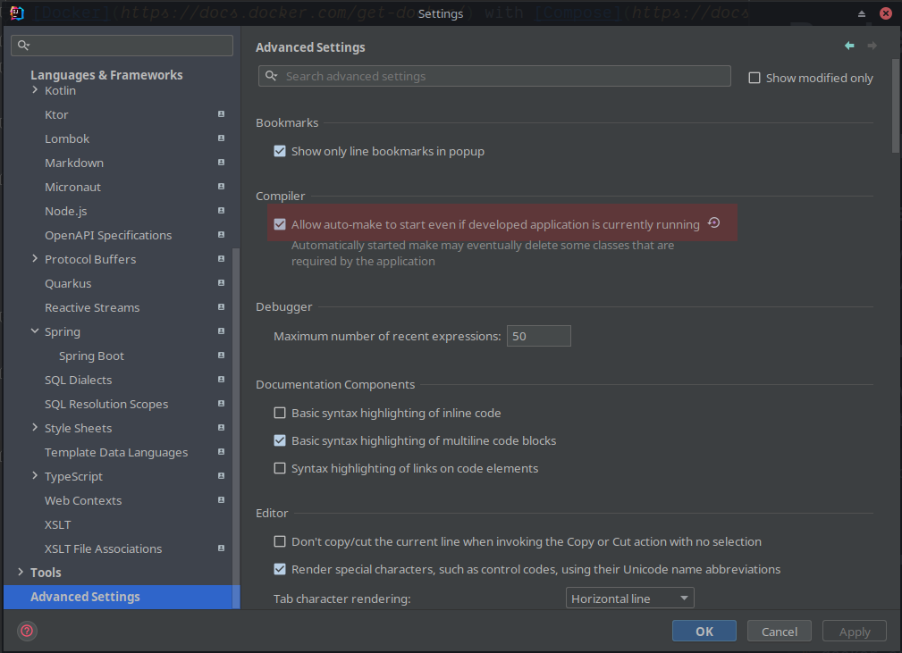

# Basically Wordle. - Backend

## Development (Linux/ WSL)
### Pre-requisites
- [Docker](https://docs.docker.com/get-docker/) with [Compose](https://docs.docker.com/compose/install/)
  - For Windows, go with [Docker Desktop](https://docs.docker.com/desktop/windows/install/)
### Development
Run the following command to start the PostgreSQL and Redis database:
```shell
$ docker-compose up -d
```

You can then use IntelliJ run configurations to launch the server as usual.

To shut down the compose stack, run:
```shell
$ docker-compose down
```

### Auto-reload backend
Enable "Build project automatically":

Enable "Allow auto-make to start even if developed application is currently running":
