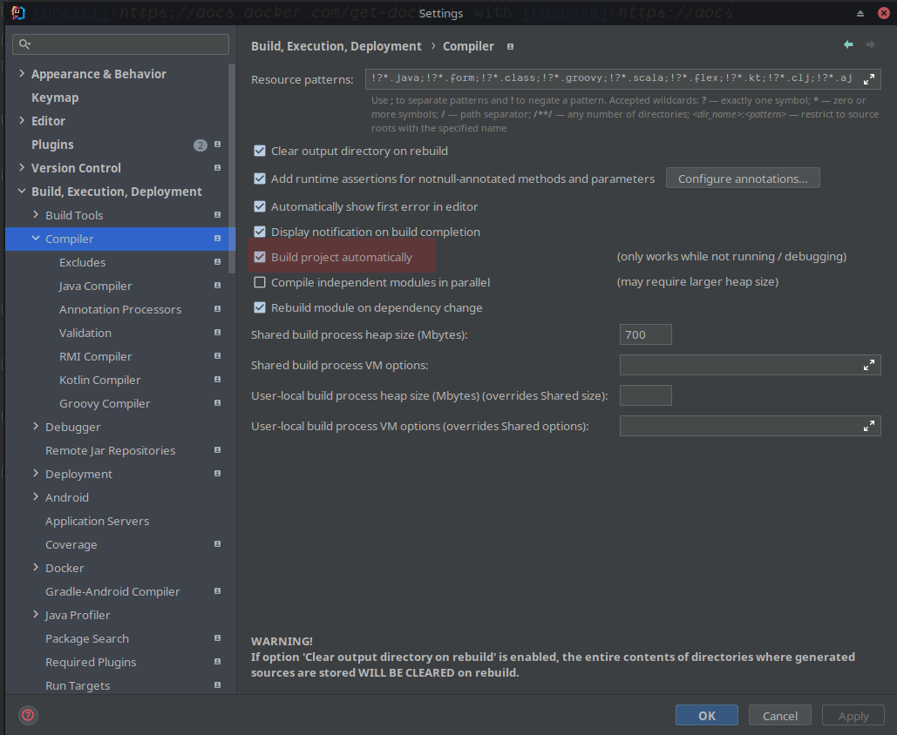

# Basically Wordle. - Backend

[](https://github.com/sopra-fs22-group-09/basically-wordle-backend/actions/workflows/deploy.yml)
[](https://sonarcloud.io/summary/new_code?id=sopra-fs22-group-09_basically-wordle-backend)
[](https://sonarcloud.io/summary/new_code?id=sopra-fs22-group-09_basically-wordle-backend)
[](https://sonarcloud.io/summary/new_code?id=sopra-fs22-group-09_basically-wordle-backend)

Wordle PvP Backend implementation with Spring Boot and GraphQL.

# Introduction

“Basically Wordle.” is a game based on the recent trending quiz “Wordle”. The goal is to find a target word that consists of five letters. The player gets six attempts to find the word. A letter that is part of the target word gets marked yellow and if the letter matches the position, it gets marked green. To further aid the player, letters that aren’t part of the solution get marked in a darker grey.

We decided to take a multiplayer approach where users can join lobbies and play against each other. This means there are two different categories users can choose from. PvP means that players contend with each other and Solo provides a casual mode without competitive pressure that is basically the same as the original.

# Technologies

- Spring Boot
  - WebFlux
  - GraphQL
  - Mail
- Spring Security
  - Crypto
- Reactor 3
- Spring Data
  - JPA
  - Redis (Reactive)
  - Postgres
- Mockito
- Lombok
- JUnit Juniper
- Gradle

# High-level Components

It is difficult to pinpoint a few "main" components as the server project is rather complex but provides a very uniform interface thanks to GraphQL.  
At its technical core, we have a set of repositories which provide data through various GraphQL Data Fetching Environments.
Those are backed by either Postgres or Redis respectively. Data is made available through a collection of both blocking and non-blocking services.  
To begin with, a major component are the [External APIs](src/main/java/ch/uzh/sopra/fs22/backend/wordlepvp/repository/WordsRepository.java) which we use to extend the very limited and static set of words originally available.  
The second major component is the [Game Logic](src/main/java/ch/uzh/sopra/fs22/backend/wordlepvp/model/GameLogic.java) which is comprised by a multitude of different classes responsible for handling the game flow and different modes.  
Another big component is the [Authorization & Authentication logic](src/main/java/ch/uzh/sopra/fs22/backend/wordlepvp/repository/AuthRepository.java) which is scattered around many classes and makes sure that every request happens according to well-defined Access Controls.  
Lastly, the GraphQL [Schema](src/main/resources/graphql/schema.graphqls) is the common denominator of the full-stack web application as it specifies the main data exchange interface.

# Launch & Deployment

The backend will be launched at http://localhost:8080.

## Launch
### Pre-requisites
- [Docker](https://docs.docker.com/get-docker/) with [Compose](https://docs.docker.com/compose/install/)
  - For Windows, go with [Docker Desktop](https://docs.docker.com/desktop/windows/install/)
### Development
Run the following command to start the PostgreSQL and Redis database:
```shell
$ docker-compose up -d
```

Set the `local` profile in the run configurations dialog:  


You can now use IntelliJ run configurations to launch the server as usual.

To shut down the compose stack, run:
```shell
$ docker-compose down
```

The backend will then be launched at http://localhost:8080.

### Testing

Tests can be run from inside the IDE (e.g. IntelliJ) by running the [Test](src/test) package. Tests will also always be executed when creating a PR via CI.
You can also execute tests directly via Gradle using `gradlew.exe test` on Windows or `./gradlew test` on Linux.

## Deployment

As we do not use Heroku for deployment there is no reference to provide as this required a rather complex custom setup.  
For contributions to the existing infrastructure just deploy a new backend release by committing to a new branch, and then opening and merging a PR into the `master` branch. 

### Auto-reload backend
Enable "Build project automatically":  

Enable "Allow auto-make to start even if developed application is currently running":  


# Roadmap

- A ranking system with scoreboards
- A chat system
- More game modes

# Authors and acknowledgement

Made by SoPraFS22 Group 9.

- Jerome Maier
- Mete Polat
- Elvio Petillo
- Matej Gurica

# License

MIT License. See [LICENSE](./LICENSE).  
The license is provisional and subject to change. All rights reserved.
